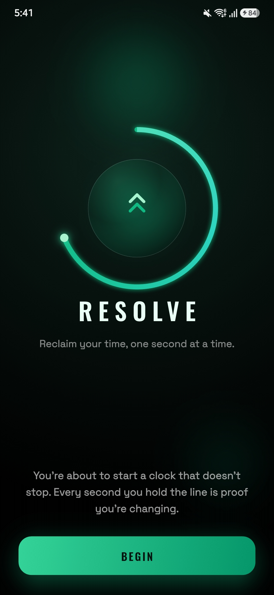
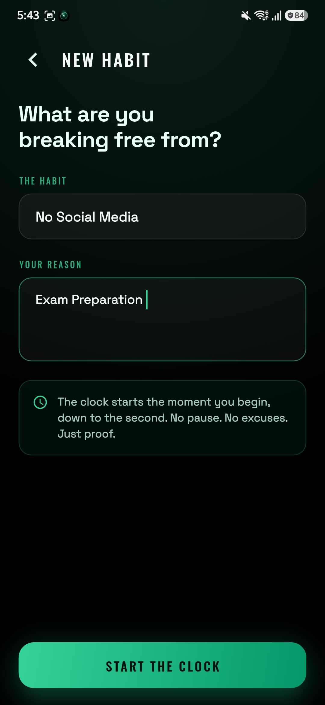
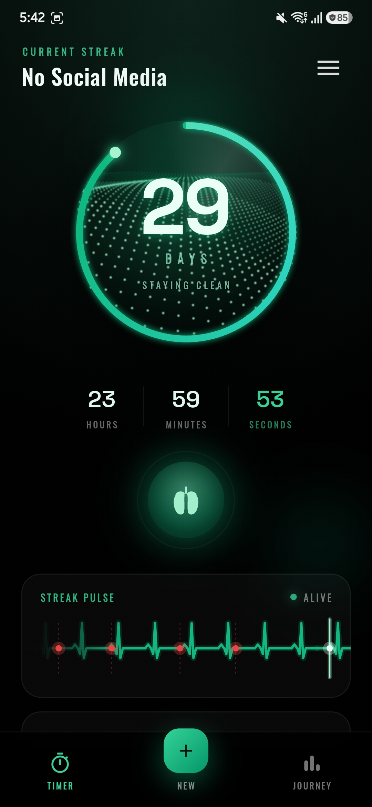
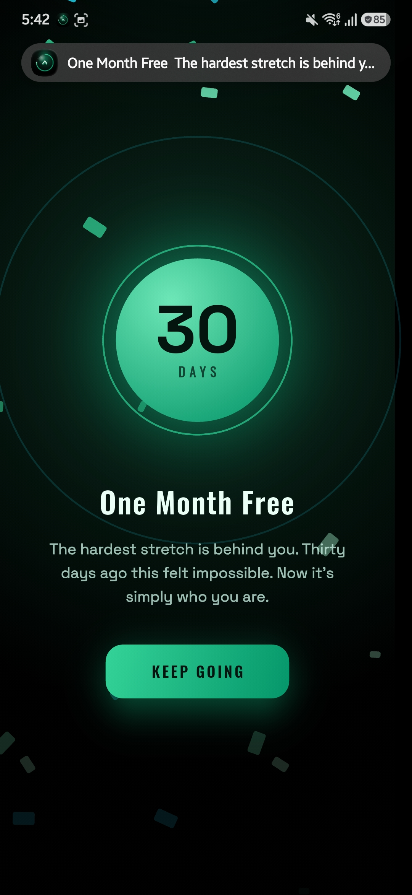
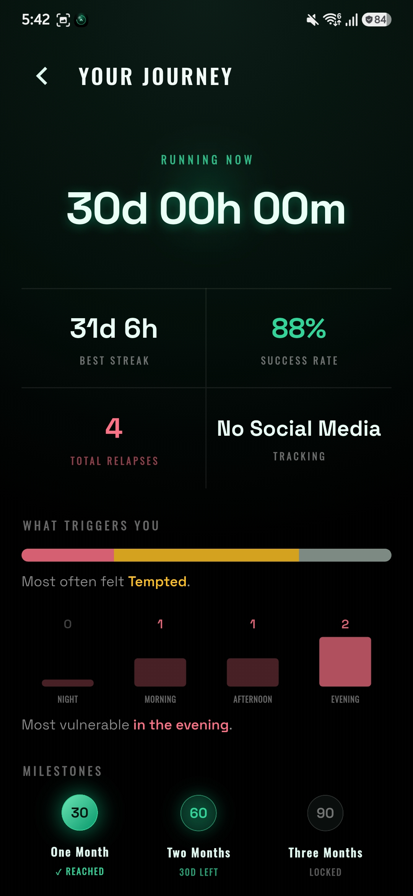

# Resolve

[](https://github.com/atikulmunna/resolve/releases/download/v1.0.0/resolve-v1.0.0.apk)
[](https://resolve.en.uptodown.com/android)

**Resolve** turns quitting a bad habit into a live streak timer. From the moment you commit, an infinite clock counts up (days, hours, minutes, seconds) inside a frosted-glass dial on true AMOLED black. If you slip, you log a mood and a note, the timer resets, and the history stays. No feeds, no accounts, no noise, just the one number that matters.

## Screenshots

<div align="center">
<table>
  <tr>
    <td></td>
    <td></td>
    <td></td>
    <td></td>
    <td></td>
  </tr>
</table>
</div>

## Features

- **Live streak timer:** a frosted-glass hero dial with a 60-second circular progress ring, counting every second since you committed.
- **Panic mode:** one tap opens a full-screen 4-7-8 breathing guide with an animated lung and your own reason for quitting, for the moment a craving hits.
- **Honest relapse logging:** slipped? Log how you felt and why. The timer resets, but nothing is erased.
- **Relapse insights:** the Journey page surfaces what triggers you and when you are most vulnerable, drawn purely from your own history.
- **Milestones:** 30, 60, and 90-day marks unlock a celebration; un-earned milestones stay locked.
- **Home-screen widget:** a native, glanceable streak that adapts to widget size and light or dark mode.
- **Milestone notifications:** local alerts fire as you cross each threshold, even with the app closed.
- **Backup and restore:** export your streak and full history to a file, import it on any device.

## How it works

A few engineering decisions define the app:

- **The streak is derived state, never a stored counter.** The displayed time is always `now() - startedAt`, so it stays correct across force-quits, reboots, and days offline. Timestamps are stored in UTC.
- **One master clock.** A single `AnimationController` drives every live element on the home screen (the ring, the breathing pulse, the timer) and pauses when the app is backgrounded.
- **The widget computes its own day count.** A widget cannot run a Flutter timer, so the native Kotlin `AppWidgetProvider` reads `startedAt` and recomputes the day count itself, drawing the progress ring as a bitmap. The same `now() - startedAt` rule, in native code.
- **Fully offline.** No backend, no analytics, no sign-up. All data lives on-device in `shared_preferences`.

## Tech stack

| Area | Tools |
|---|---|
| App | **Flutter (Dart)** |
| Native widget | **Kotlin**: `AppWidgetProvider`, `RemoteViews`, `Canvas` |
| Custom rendering | `CustomPainter`: dial, ring, EKG streak pulse, anatomical lung |
| Persistence | `shared_preferences` (offline-first) |
| Notifications | `flutter_local_notifications` + `timezone` |
| Build | Gradle (Kotlin DSL), signed release, product flavors |

Design language: iOS "liquid glass" on AMOLED black `#000` with an emerald accent. **Oswald** for labels and **Space Grotesk** for numerals, both bundled for offline use.

## Build and run

```bash
flutter pub get
flutter run                       # debug on a connected device
flutter build apk --release       # signed release (requires android/key.properties)
```

**Requirements:** Flutter SDK, Android 7.0+ (minSdk 24, targetSdk 36). Portrait only.

## Project structure

```
lib/
├── core/         streak math, master clock, notifications, widget bridge
├── data/         persistence, habit store, backup
├── models/       habit, relapse, mood
├── features/     home, craving, journey, relapse, celebration, onboarding
├── theme/        palette, typography
└── widgets/      shared glass components
android/app/src/main/kotlin/  native home-screen widget (Kotlin)
```
